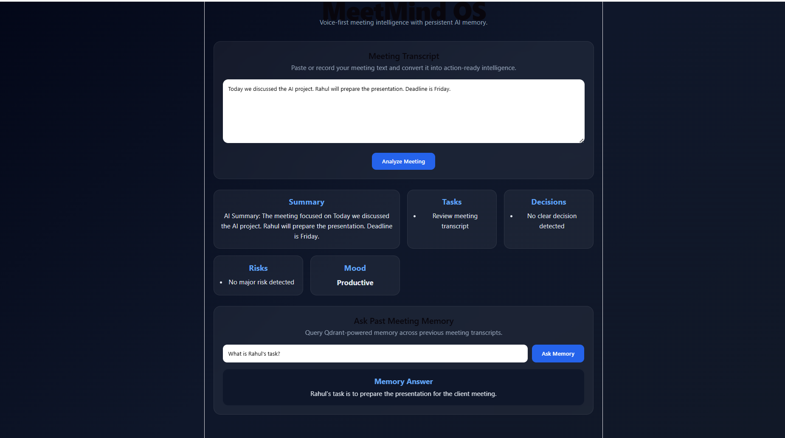

# 🚀 MeetMind OS

### Voice-First AI Meeting Intelligence Platform

MeetMind OS is an AI-powered meeting assistant that transforms meeting conversations into actionable insights. The platform analyzes meeting transcripts, extracts important information, stores organizational memory, and allows users to query previous meeting knowledge through natural language.

---

## ✨ Key Features

### 📝 Smart Meeting Analysis

* AI-powered transcript processing
* Automatic meeting summarization
* Context-aware insight generation

### ✅ Task Extraction

* Detects action items automatically
* Identifies assigned responsibilities
* Tracks important follow-up activities

### 🎯 Decision Detection

* Extracts key decisions from discussions
* Highlights important outcomes
* Creates decision history for future reference

### ⚠️ Risk Identification

* Detects potential project risks
* Identifies blockers and concerns
* Improves meeting awareness

### 😊 Mood Analysis

* Analyzes overall meeting sentiment
* Detects team engagement level
* Provides productivity insights

### 🧠 Persistent AI Memory

* Stores meeting knowledge using Qdrant Vector Database
* Retrieves information from previous meetings
* Enables natural-language memory search

---
## Dashboard Preview


---

## 🏗️ System Architecture

Meeting Transcript

↓

Spring Boot Backend API

↓

AI Analysis Service

↓

Qdrant Vector Memory

↓

React Dashboard

↓

Memory Query System

---

## 💻 Technology Stack

### Frontend

* React.js
* Vite
* JavaScript
* CSS3

### Backend

* Java
* Spring Boot
* Maven

### Database

* Qdrant Vector Database

### AI Layer

* AI Analysis Service
* Semantic Memory Search

---

## 📂 Project Structure

MeetMind-OS/

├── Backend/

│ ├── src/

│ ├── pom.xml

│ └── application.properties

│

├── Frontend/

│ ├── src/

│ ├── public/

│ ├── package.json

│ └── vite.config.js

│

└── README.md

---

## ⚙️ Running the Project

### Backend

```bash
cd Backend/Backend
.\mvnw.cmd spring-boot:run
```

Backend URL:

```text
http://localhost:8080
```

### Frontend

```bash
cd Frontend
npm install
npm run dev
```

Frontend URL:

```text
http://localhost:5173
```

---

## 📌 Available APIs

### Analyze Meeting

```http
POST /api/analyze
```

### Ask Meeting Memory

```http
POST /api/memory/ask
```

### Fetch Stored Memories

```http
GET /api/qdrant/memories
```

---

## 🔮 Future Enhancements

* Real-time meeting transcription
* Voice input integration
* Multi-user collaboration
* Calendar integration
* Action-item reminders
* Meeting timeline visualization
* AI-generated follow-up emails
* Advanced analytics dashboard

---

## 👨‍💻 Author

Anay Choudhary

Open Summer Internship Hackathon 2026

---

## 📄 License

This project was developed for educational and hackathon purposes.
